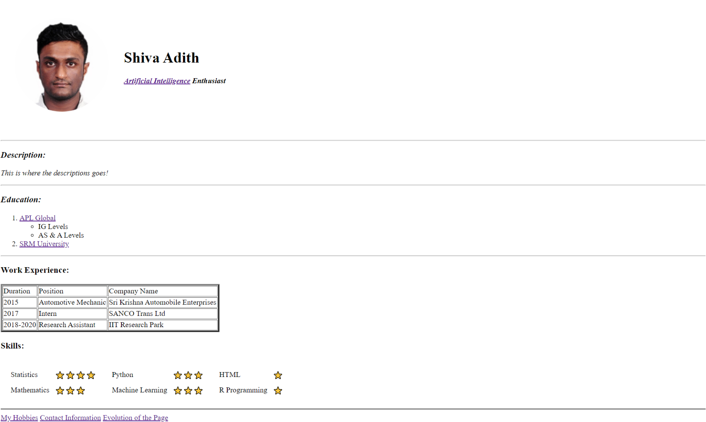
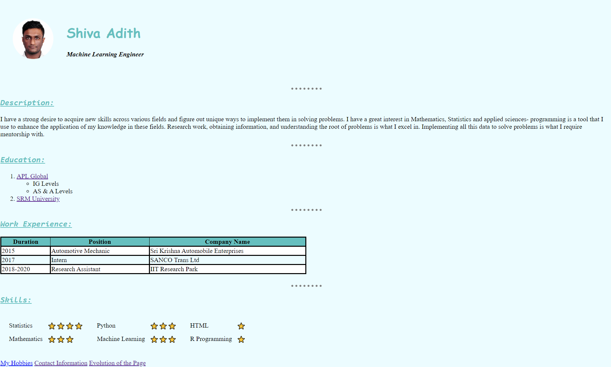

<!DOCTYPE html>
<html lang="en">
  <body>
    <h1>Portfolio Website</h1>
    <h3><em><strong>Welcome to my Resume! <a href="https://shiva-adith.github.io/my_portfolio/">(Website Link)</a></strong></em></h3>
     
    
What I've done, what I'm currently doing, the projects that I have lined up... you can find all of those - and more, in this one ✨<em><strong>Amateur</strong></em>✨ web-page.

    
I started out in Web-development during peak lockdown.

     
    
This is what my page looked like at first...
 
    
     
    <h3>Yikes!</h3>
    
but then, I improved the design... a <strong>bit</strong>

    
     
    
Pretty neat how a basic level of CSS can make a decent difference huh!

     
    
It then took me a couple of weeks of serious research to get to this stage:

    

      <h1 align=center><a href="https://shiva-adith.github.io/my_portfolio/">This is what it looks like now!</a></h1>
    

     
    
Yup. You have got to visit the site to see the rest :)

     
    
Feel free to use the design templates and tinker with it to suit your style!

  </body>
</html>
